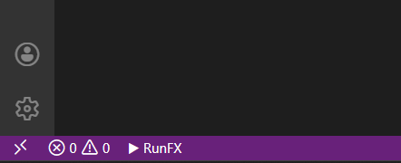
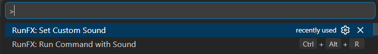

# RunFX

RunFX is a VS Code extension that plays a sound effect every time you run code from anywhere in your workspace. Supercharge your workflow with instant audio feedback and a beautiful, customizable experience!

---

## 🚀 Features

- **Status Bar Button:** Instantly run any command from the bottom left "▶ RunFX" button.
- **Keyboard Shortcut:** Press `Ctrl+Alt+R` to open the RunFX command picker from anywhere.
- **Recent Commands:** Remembers your last 10 commands for quick re-use.
- **Custom Sound:** Choose your own sound file (mp3, wav, etc.) to play when you run code. RunFX remembers your last 10 custom sounds for easy switching.
- **Workspace-Aware:** Commands run in the folder of your active file, or the workspace root.
- **Command Palette Integration:** All features accessible via `Ctrl+Shift+P` or the Command Palette.

---

## 🖼️ Screenshots

### Status Bar Button

### Setting a Custom Sound

---

## 🎧 How to Set a Custom Sound

1. **Open the Command Palette:**
   - Press `Ctrl+Shift+P` (Windows/Linux) or `Cmd+Shift+P` (Mac), or click "Show All Commands" in the menu.
2. **Type `RunFX: Set Custom Sound` and select it.**
3. **Choose from your previous sounds or click "+ Select new sound file" to pick any audio file (mp3, wav, ogg, etc.).**
4. **Your selected sound will play every time you run a command with RunFX!**

> You can always change your sound later. RunFX remembers your last 10 custom sounds for easy switching.

---

## ⚡ Usage

- Click the **▶ RunFX** button in the status bar, or press `Ctrl+Alt+R`.
- Select a recent command or enter a new one.
- The command runs in the folder of your active file (or workspace root), and your chosen sound plays!

---

## Requirements

- No special requirements. Works on all platforms with VS Code 1.110.0 or newer.

---

## Known Issues

- If you select a sound file that is later moved or deleted, you will need to set a new sound.
- Only one sound plays at a time (no sound queue).

---

## Release Notes

### 1.0.0
- Initial release: Status bar, keyboard shortcut, recent commands, custom sound (with history), and workspace-aware running.

---

## Contributing

Pull requests and feedback are welcome! Please open an issue for bugs or feature requests.

---

**Enjoy using RunFX!**
